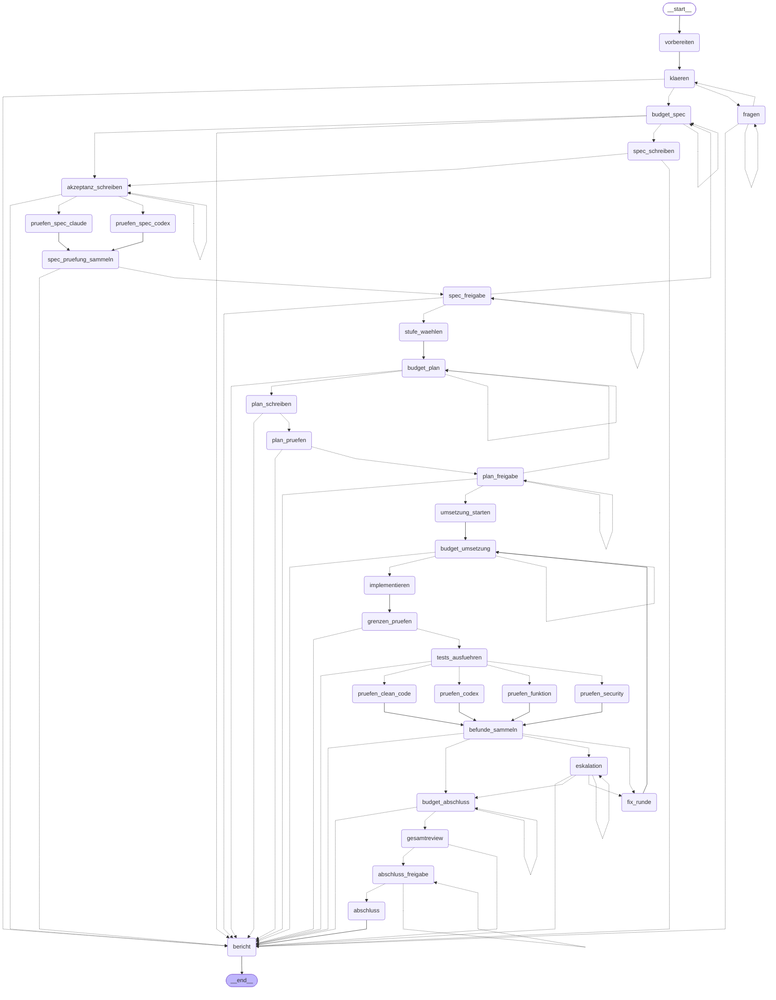

# The complete graph

Generated from the code with `baue_graph_s4().get_graph().draw_mermaid()` (stage 4 to 7, the default). Dashed edges are conditional.

```mermaid
---
config:
  flowchart:
    curve: linear
---
graph TD;
	__start__([<p>__start__</p>]):::first
	vorbereiten(vorbereiten)
	klaeren(klaeren)
	fragen(fragen)
	spec_schreiben(spec_schreiben)
	akzeptanz_schreiben(akzeptanz_schreiben)
	pruefen_spec_claude(pruefen_spec_claude)
	stufe_waehlen(stufe_waehlen)
	budget_spec(budget_spec)
	budget_plan(budget_plan)
	pruefen_spec_codex(pruefen_spec_codex)
	spec_pruefung_sammeln(spec_pruefung_sammeln)
	spec_freigabe(spec_freigabe)
	plan_schreiben(plan_schreiben)
	plan_pruefen(plan_pruefen)
	plan_freigabe(plan_freigabe)
	umsetzung_starten(umsetzung_starten)
	budget_abschluss(budget_abschluss)
	gesamtreview(gesamtreview)
	abschluss_freigabe(abschluss_freigabe)
	abschluss(abschluss)
	implementieren(implementieren)
	grenzen_pruefen(grenzen_pruefen)
	tests_ausfuehren(tests_ausfuehren)
	pruefen_funktion(pruefen_funktion)
	pruefen_security(pruefen_security)
	pruefen_clean_code(pruefen_clean_code)
	pruefen_codex(pruefen_codex)
	befunde_sammeln(befunde_sammeln)
	fix_runde(fix_runde)
	eskalation(eskalation)
	bericht(bericht)
	budget_umsetzung(budget_umsetzung)
	__end__([<p>__end__</p>]):::last
	__start__ --> vorbereiten;
	abschluss --> bericht;
	abschluss_freigabe -.-> abschluss;
	akzeptanz_schreiben -.-> bericht;
	akzeptanz_schreiben -.-> pruefen_spec_claude;
	akzeptanz_schreiben -.-> pruefen_spec_codex;
	befunde_sammeln -.-> bericht;
	befunde_sammeln -.-> budget_abschluss;
	befunde_sammeln -.-> eskalation;
	befunde_sammeln -.-> fix_runde;
	budget_abschluss -.-> bericht;
	budget_abschluss -.-> gesamtreview;
	budget_plan -.-> bericht;
	budget_plan -.-> plan_schreiben;
	budget_spec -.-> akzeptanz_schreiben;
	budget_spec -.-> bericht;
	budget_spec -.-> spec_schreiben;
	budget_umsetzung -.-> bericht;
	budget_umsetzung -.-> implementieren;
	eskalation -.-> bericht;
	eskalation -.-> budget_abschluss;
	eskalation -.-> fix_runde;
	fix_runde --> budget_umsetzung;
	fragen -.-> bericht;
	fragen -.-> klaeren;
	gesamtreview -.-> abschluss_freigabe;
	gesamtreview -.-> bericht;
	grenzen_pruefen -.-> bericht;
	grenzen_pruefen -.-> tests_ausfuehren;
	implementieren --> grenzen_pruefen;
	klaeren -.-> bericht;
	klaeren -.-> budget_spec;
	klaeren -.-> fragen;
	plan_freigabe -.-> bericht;
	plan_freigabe -.-> budget_plan;
	plan_freigabe -.-> umsetzung_starten;
	plan_pruefen -.-> bericht;
	plan_pruefen -.-> plan_freigabe;
	plan_schreiben -.-> bericht;
	plan_schreiben -.-> plan_pruefen;
	pruefen_clean_code --> befunde_sammeln;
	pruefen_codex --> befunde_sammeln;
	pruefen_funktion --> befunde_sammeln;
	pruefen_security --> befunde_sammeln;
	pruefen_spec_claude --> spec_pruefung_sammeln;
	pruefen_spec_codex --> spec_pruefung_sammeln;
	spec_freigabe -.-> bericht;
	spec_freigabe -.-> budget_spec;
	spec_freigabe -.-> stufe_waehlen;
	spec_pruefung_sammeln -.-> bericht;
	spec_pruefung_sammeln -.-> spec_freigabe;
	spec_schreiben -.-> akzeptanz_schreiben;
	spec_schreiben -.-> bericht;
	stufe_waehlen --> budget_plan;
	tests_ausfuehren -.-> bericht;
	tests_ausfuehren -.-> pruefen_clean_code;
	tests_ausfuehren -.-> pruefen_codex;
	tests_ausfuehren -.-> pruefen_funktion;
	tests_ausfuehren -.-> pruefen_security;
	umsetzung_starten --> budget_umsetzung;
	vorbereiten --> klaeren;
	bericht --> __end__;
	abschluss_freigabe -.-> abschluss_freigabe;
	akzeptanz_schreiben -.-> akzeptanz_schreiben;
	budget_abschluss -.-> budget_abschluss;
	budget_plan -.-> budget_plan;
	budget_spec -.-> budget_spec;
	budget_umsetzung -.-> budget_umsetzung;
	eskalation -.-> eskalation;
	fragen -.-> fragen;
	plan_freigabe -.-> plan_freigabe;
	spec_freigabe -.-> spec_freigabe;
	classDef default fill:#f2f0ff,line-height:1.2
	classDef first fill-opacity:0
	classDef last fill:#bfb6fc
```
